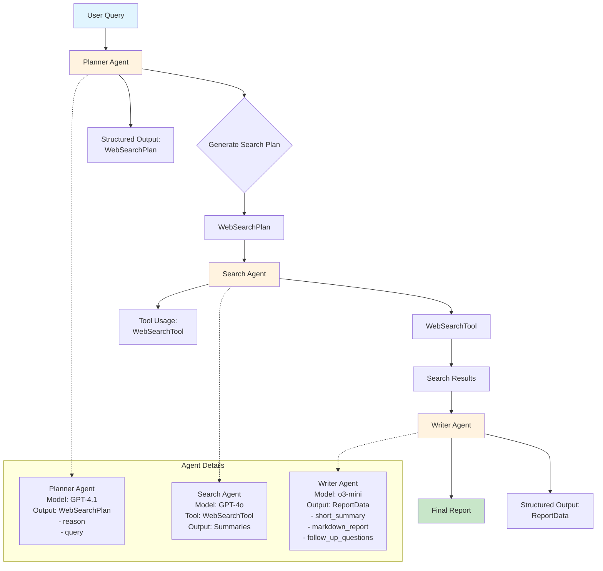

# Research Workflow Agent Interaction Flowchart

## Key Interactions:

1. **User Query** → **Planner Agent**: Generates structured search plan
2. **Planner Agent** → **Search Agent**: Provides search queries with reasoning
3. **Search Agent** → **WebSearchTool**: Executes web searches
4. **Search Agent** → **Writer Agent**: Provides summarized research results
5. **Writer Agent** → **Final Report**: Synthesizes comprehensive report

## Data Flow:
- **WebSearchPlan**: Contains list of search items with reason and query
- **Search Results**: Summarized findings from web searches
- **ReportData**: Structured final output with summary, report, and follow-up questions 