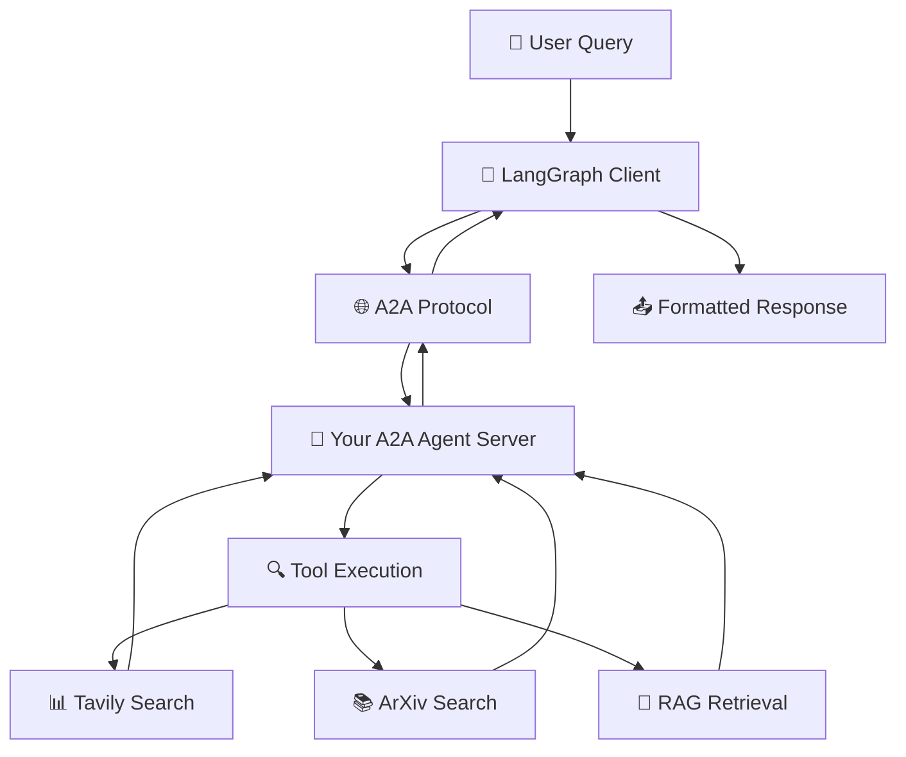

# 🤖 A2A Client Graphs - Using Your A2A Application

This directory contains **LangGraph Graphs** that act as clients to communicate with your A2A agent server through the A2A protocol. These graphs demonstrate how to build a **Simple Agent** that can make API calls to your existing 🤖Agent Node.

## 🎯 What This Accomplishes

The task asks you to: **"Build a LangGraph Graph to 'use' your application"** by creating a **Simple Agent** that can make API calls to the 🤖Agent Node through the A2A protocol.

### ✅ What We've Built

1. **Basic A2A Client Graph** (`a2a_client_graph.py`)
   - Simple LangGraph that communicates with your A2A agent server
   - Handles basic request/response cycles
   - Demonstrates A2A protocol integration

2. **Advanced A2A Client Graph** (`advanced_a2a_client_graph.py`)
   - Multi-turn conversation support
   - Streaming response handling
   - Error handling and retry logic
   - Conversation state management

3. **Test Script** (`test_a2a_client_graphs.py`)
   - Comprehensive testing of both graphs
   - Demonstrates usage patterns
   - Error handling validation

## 🏗️ Architecture Overview



## 🚀 Quick Start

### Prerequisites

1. **Start your A2A agent server**:
   ```bash
   # In one terminal
   uv run python -m app
   ```

2. **Verify the server is running**:
   ```bash
   # Test the server
   uv run python app/test_client.py
   ```

### Running the A2A Client Graphs

#### Basic Graph Test
```bash
# Test the basic A2A client graph
uv run python app/a2a_client_graph.py
```

#### Advanced Graph Test
```bash
# Test the advanced A2A client graph with multi-turn conversations
uv run python app/advanced_a2a_client_graph.py
```

#### Comprehensive Test Suite
```bash
# Run all tests
uv run python app/test_a2a_client_graphs.py
```

## 📁 File Structure

```
app/
├── a2a_client_graph.py              # Basic A2A client graph
├── advanced_a2a_client_graph.py     # Advanced A2A client graph with multi-turn support
├── test_a2a_client_graphs.py        # Test script for both graphs
├── A2A_CLIENT_GRAPHS_README.md      # This file
└── ... (existing files)
```

## 🔧 Implementation Details

### 1. Basic A2A Client Graph (`a2a_client_graph.py`)

**Purpose**: Simple LangGraph that communicates with your A2A agent server.

**Key Features**:
- A2A protocol integration
- Basic request/response handling
- Error handling
- State management

**Graph Structure**:
```python
graph.add_node("call_a2a_agent", self.call_a2a_agent)      # Make API call
graph.add_node("format_response", self.format_response)     # Format response
graph.add_edge("call_a2a_agent", "format_response")         # Flow
graph.add_edge("format_response", END)                      # End
```

**Usage**:
```python
# Create the graph
graph_instance, graph = await create_a2a_client_graph()

# Initialize state
initial_state = {
    "messages": [HumanMessage(content="Your query here")],
    "a2a_response": "",
    "task_id": "",
    "context_id": "",
    "is_complete": False
}

# Run the graph
result = await graph.ainvoke(initial_state)
print(result["messages"][-1].content)
```

### 2. Advanced A2A Client Graph (`advanced_a2a_client_graph.py`)

**Purpose**: Sophisticated client with multi-turn conversation support.

**Key Features**:
- Multi-turn conversations
- Streaming response support
- Retry logic with exponential backoff
- Conversation history tracking
- Error handling and recovery

**Graph Structure**:
```python
graph.add_node("decide_response_type", self.decide_response_type)
graph.add_node("call_a2a_agent", self.call_a2a_agent)
graph.add_node("call_a2a_agent_streaming", self.call_a2a_agent_streaming)
graph.add_node("format_response", self.format_response)
```

**Usage**:
```python
# Create the advanced graph
graph_instance, graph = await create_advanced_a2a_client_graph()

# Multi-turn conversation
conversation_queries = [
    "What are the latest AI developments?",
    "Find papers on transformers",
    "Summarize the key findings"
]

current_state = {
    "messages": [],
    "a2a_response": "",
    "task_id": "",
    "context_id": "",
    "is_complete": False,
    "conversation_history": [],
    "error_count": 0,
    "max_retries": 3
}

for query in conversation_queries:
    current_state["messages"] = [HumanMessage(content=query)]
    result = await graph.ainvoke(current_state)
    
    # Update state for next turn
    current_state.update({
        "task_id": result.get("task_id", ""),
        "context_id": result.get("context_id", ""),
        "conversation_history": result.get("conversation_history", [])
    })
```

## 🔄 A2A Protocol Integration

### How the Graphs Use the A2A Protocol

1. **Agent Card Discovery**:
   ```python
   resolver = A2ACardResolver(httpx_client=httpx_client, base_url=server_url)
   agent_card = await resolver.get_agent_card()
   ```

2. **Client Initialization**:
   ```python
   client = A2AClient(httpx_client=httpx_client, agent_card=agent_card)
   ```

3. **Message Sending**:
   ```python
   request = SendMessageRequest(
       id=str(uuid4()),
       params=MessageSendParams(**send_message_payload)
   )
   response = await client.send_message(request)
   ```

4. **Response Processing**:
   ```python
   result = response.root.result
   task_id = result.id
   context_id = result.context_id
   content = result.content
   ```

### Multi-turn Conversation Support

The advanced graph maintains conversation context:

```python
# Add task_id and context_id for multi-turn conversations
if state.get("task_id") and state.get("context_id"):
    send_message_payload['message']['task_id'] = state["task_id"]
    send_message_payload['message']['context_id'] = state["context_id"]
```

## 🧪 Testing

### Running Tests

```bash
# Test both graphs
uv run python app/test_a2a_client_graphs.py
```

### Test Coverage

The test script covers:

1. **Basic Graph Testing**:
   - Single query processing
   - Response formatting
   - Error handling

2. **Advanced Graph Testing**:
   - Multi-turn conversations
   - State management
   - Conversation history

3. **Error Handling**:
   - Invalid server URLs
   - Network timeouts
   - Retry logic

### Expected Output

```
🧪 Starting A2A Client Graph Tests
Make sure your A2A agent server is running on http://localhost:10000

============================================================
🧪 Testing Basic A2A Client Graph
============================================================

--- Test Query 1 ---
Query: What are the latest developments in artificial intelligence?
✅ Response received successfully!
Response preview: 🤖 A2A Agent Response: Based on recent developments in artificial intelligence...

============================================================
🚀 Testing Advanced A2A Client Graph
============================================================

--- Turn 1 ---
Query: What are the latest developments in artificial intelligence?
✅ Response received successfully!
Response preview: 🤖 A2A Agent Response: Recent developments in AI include...
Task ID: abc123
Context ID: def456

🎉 All tests completed!
```

## 🔧 Customization

### Adding New Features

1. **Custom Response Formatting**:
   ```python
   def custom_format_response(self, state: Dict[str, Any]) -> Dict[str, Any]:
       # Your custom formatting logic
       return {"messages": [AIMessage(content=formatted_content)]}
   ```

2. **Additional Error Handling**:
   ```python
   async def call_a2a_agent_with_custom_retry(self, state: Dict[str, Any]) -> Dict[str, Any]:
       # Custom retry logic
       for attempt in range(self.max_retries):
           try:
               # Your logic here
               pass
           except CustomException as e:
               # Handle specific exceptions
               pass
   ```

3. **Streaming Response Processing**:
   ```python
   async def process_streaming_chunks(self, stream_response):
       async for chunk in stream_response:
           # Custom chunk processing
           yield processed_chunk
   ```

### Configuration Options

```python
# Custom server URL
graph_instance, graph = await create_a2a_client_graph("http://your-server:8080")

# Custom retry settings
graph_instance, graph = await create_advanced_a2a_client_graph(
    server_url="http://localhost:10000",
    max_retries=5
)
```

## 🐛 Troubleshooting

### Common Issues

1. **Server Not Running**:
   ```
   Error: Failed to fetch the public agent card
   Solution: Start your A2A agent server with `uv run python -m app`
   ```

2. **Network Timeouts**:
   ```
   Error: Timeout error
   Solution: Increase timeout in httpx.AsyncClient(timeout=httpx.Timeout(120.0))
   ```

3. **A2A Protocol Errors**:
   ```
   Error: Invalid A2A response format
   Solution: Check that your A2A server is properly configured
   ```

### Debug Mode

Enable detailed logging:

```python
import logging
logging.basicConfig(level=logging.DEBUG)
```

## 📚 Learning Objectives Achieved

✅ **A2A Protocol Understanding**: How agents communicate through standardized protocols

✅ **LangGraph Client Implementation**: Building graphs that act as clients

✅ **Multi-turn Conversations**: Managing conversation state and context

✅ **Error Handling**: Robust error handling and retry logic

✅ **API Integration**: Integrating with external services through protocols

## 🎯 Next Steps

1. **Extend the graphs** with additional features
2. **Add more sophisticated conversation management**
3. **Implement custom evaluation criteria**
4. **Build specialized agents for different domains**
5. **Add authentication and security features**

---

This implementation successfully demonstrates how to build a **LangGraph Graph** that **"uses" your A2A application** by creating a **Simple Agent** that communicates with your 🤖Agent Node through the **A2A protocol**. The graphs showcase both basic and advanced patterns for agent-to-agent communication.
